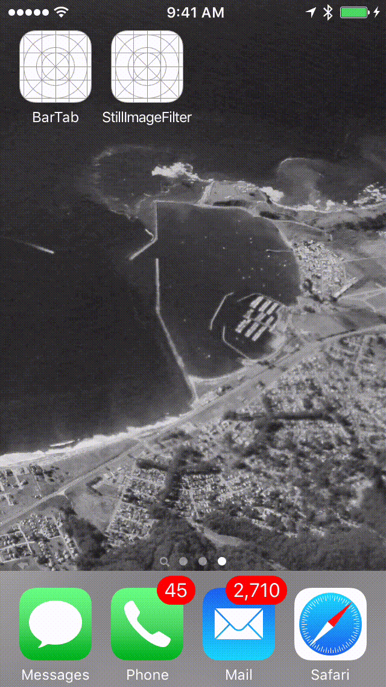

# Flight Plan
The bullets below provide a flyover view of the broad areas where code has been under construction.

- Viewables
- Layout
- Capture
- Encrypt
- Filter

The focus since revisiting development an Apple platforms in 2010 has been design iterations from the inside out - tackling the toughest design problems - even if the solutions are not the most stylish, user visible ones. Specific design aspects as examples are key internal framework decisions in the data pipelines as well as building a better intuition about what makes sense to approach in Objective-C or Swift.

# Works in Progress - Screen Transitions

- Filters

- Capture, Filter and Detection (first steps)

# Next Steps

As far as practical engineering practices - work needed to re-introduce unit tests as well as scrub post iOS 9.x and XCode 7.x warnings, etc. This is par for course with a new language but there has been substantial settling in late 2015 with both iOS and XCode. code iterations under way or planned include.

*Layouts*, *Gestures*

The concentration has been on data storage and display, but work underway includes more realistic data navigation around user features. The evaluation of dynamic layout approaches will continue especially comparing Pure Layout open source versus the newly ported Stack Views and Auto Layout. The degree of reliance of Interface Builder against manually code view management has been an area of ongoing investigation.

Refactoring work will continue around the scrollable image view, but for now it is in a workable form and supports the gestures below. Note the deviation from pinch to close to use a 3 finger gesture instead.

| Gesture | Action |
|---|---|
| *Single Finger Tap* | Zoom In |
| *Two Finger Tap* | Zoom Out |
| *Three Finger Tap* | Close Current Image  |

A drawer view to provide additional meta data beyond the displayable image has also been an area of experimentation with the data sourced from JSON or a remote store.

*Cameras*, *Filters*

The open source package GPUImage has been proving out in some prototypes, so that approach to applying an image Filter pipeline as an alternative to Core Image is the likely path for a few reasons.

Note that some past work to science project shape detection using CoreImage and text detection using Tesseract on iOS will be restarted again. This is enabled by the decision settling around the approach to the Filter pipeline. Initial OCR results were rough and pipeline revisions needed. The use case being worked was a lazy (manual typing avoidance) approach to build my wine database by detecting the label and then detecting and recognizing key text on the label. (So lazy may not be the right term based on complexity of the image pipeline...)

*Encrypt*

After some positive experience with the Objective-C version of RNCryptor open source package, will be evaluating the Swift version to decrypt data on the fly, arriving at a display ready form.

# Reference Code:

-[SwiftlyJSON](https://github.com/SwiftyJSON/SwiftyJSON)

-[PureLayout](https://github.com/PureLayout)

-[GPUImage](https://github.com/BradLarson/GPUImage)
